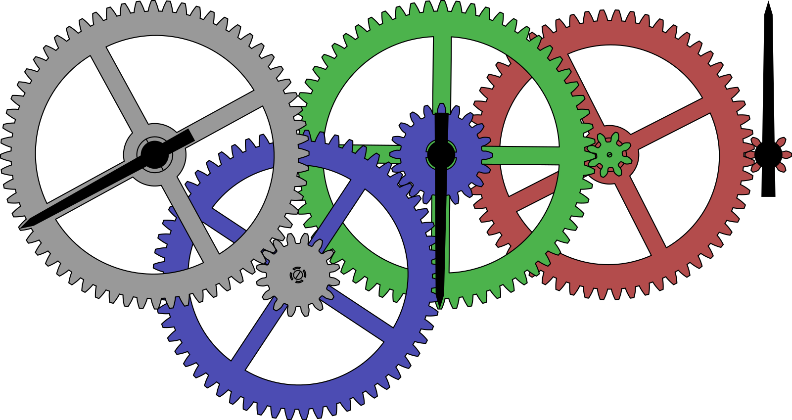

# mp-gears

This package helps to draw systems of intermeshing gears
with METAPOST. 



## Installation


### With TeX live under Linux or MacOS

To install mp-gear with TeX live, you will have to create the `texmf`
directory in your home. 
```bash
user $> mkdir ~/texmf
```

Then, you will have to place the .mp files in the
`~/texmf/tex/metapost/mp-gears/`.

mp-gears consists of one file METAPOST:
* `gears.mp`;


Once this is done, mp-gears will be loaded with the classic
```metapost
input gears
```

### With MikTEX and Windows

These two systems are unknown to the author of mp-gears, so we refer to their
documentation to add local packages:
[http://docs.miktex.org/manual/localadditions.html](http://docs.miktex.org/manual/localadditions.html)

## Documentation

* [English documentation](doc/mpchess-doc-en.pdf)

## Contact

Maxime Chupin, `maxime.chupin(at)tuta.com`

## Licenses

This projet is under LATEX Project Public License 1.3c. 
